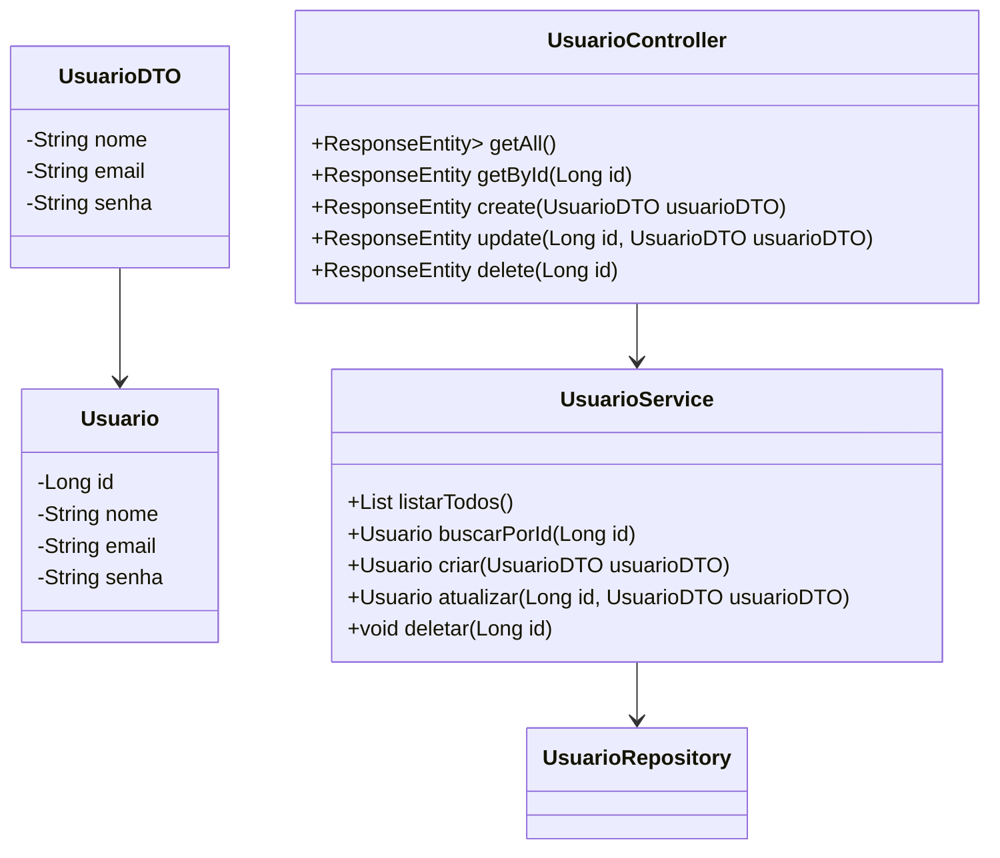

# 📌 API REST - Gestão de Usuários (Spring Boot)

Este projeto é uma **API REST** desenvolvida com **Spring Boot**, **Spring Data JPA** e **Swagger/OpenAPI**, projetada para realizar o gerenciamento de usuários de forma prática e escalável.  
O objetivo é fornecer um exemplo completo de **boas práticas** no desenvolvimento de APIs, incluindo:
- Uso de **DTOs** para transferência de dados
- Persistência com **Spring Data JPA**
- Documentação com **Swagger**
- Pronto para deploy na **Railway**

---

## 🚀 Tecnologias Utilizadas
- **Java 17+**
- **Spring Boot 3+**
- **Spring Data JPA**
- **Hibernate**
- **Swagger / OpenAPI**
- **Banco de dados MySQL** (pode ser PostgreSQL)
- **Maven**

---

## 📜 Endpoints Principais

| Método | Endpoint       | Descrição |
|--------|---------------|-----------|
| GET    | `/usuarios`   | Lista todos os usuários |
| GET    | `/usuarios/{id}` | Retorna um usuário pelo ID |
| POST   | `/usuarios`   | Cria um novo usuário |
| PUT    | `/usuarios/{id}` | Atualiza um usuário existente |
| DELETE | `/usuarios/{id}` | Remove um usuário |

---

## 📘 Documentação da API
A documentação gerada automaticamente pelo Swagger está disponível em:
http://localhost:8080/swagger-ui.html

Após o deploy no Railway, acesse:
jdbc:postgresql://postgres.railway.internal:5432/railway

    

💬 Projeto criado para o Desafio do Bootcamp Santander DIO
